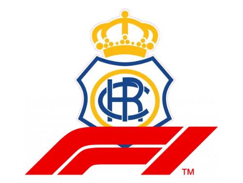

## RecreativoF1

  

## Recreativo F1, la escudería decana

**(Para iniciar sesión como mecánico)**
  - **usuario1**
  - **1234**

**(Para iniciar sesión como Jefe de equipo)** 
  - **admin**
  - **admin**

**(Para iniciar sesión como mecánico)** 
  - **usuario2**
  - **1234**
 

### Funcionalidad Mecánico

-  Iniciar sesión
-  Consultar el estado del coche
   
-  Consultar los componentes del coche
- 
   - Editar los componentes del coche
   - Borrar los componentes del coche
     
-  Comprar los componentes del coche
   - Asignarle los componentes comprados al coche deseado
     
- Consultar los resultados de la carrera
  
- Ver sus datos (salario, si tiene incentivo o no)

### Funcionalidad Jefe de equipo (Admin)

- Gestión de todos los empleados
  - Añadir
  - Eliminar
  - Editar
    
- Gestión completa de las carreras
  - Añadir
  - Eliminar
  - Borrar
  - Editar
    
- Gestión completa de los componentes
  - Comprar
  - Eliminar
  - Editar
  - Asignarlo a un coche u otro
    
- Consultar el presupuesto
  
- Consultar el resultado de los coches en la carrera
  
- Gestión de los coches
  - Editar los componentes de un coche
  - Consultar los componentes de un coche
  - Borrar los componentes de un coche
    
### Funcionalidad Pilotos 

- Consultar el resultado de la carrera
  
- Consultar el estado de los coches
  
- Consultar sus datos 
   
 
     
